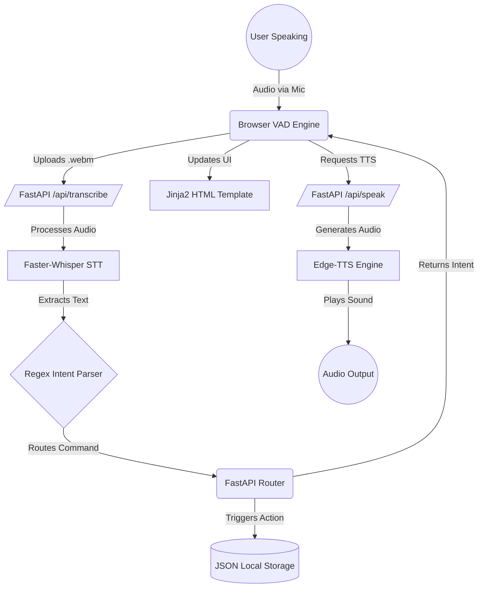

# Voice Controlled Mail System (FastAPI Demo)

An academic, highly interactive, and entirely voice-controlled modern webmail application. Built entirely with Python (FastAPI), Jinja2, and Vanilla JavaScript, this project mimics the look, feel, and functionality of a modern email client like Gmail, but relies solely on local JSON storage and local AI models for full voice accessibility.

## 🚀 What is this project?
This project is an experimental Software Engineering demonstration intended to bridge the gap between traditional UI navigation and full accessibility via Natural Language Processing (NLP). 
The primary feature is its **Hands-Free Interactive Voice Engine**, which allows users to navigate folders, read emails, search, and even compose complex emails entirely through conversational voice prompts without touching a keyboard or mouse.

## 🛠️ Technology Stack & Versions
- **Backend Framework:** FastAPI (Python 3.12+)
- **Templating:** Jinja2
- **Frontend:** Vanilla HTML5, CSS3, JavaScript (No Node.js or Webpack required)
- **Speech-to-Text (STT):** `faster-whisper` (Runs completely locally on CPU)
- **Text-to-Speech (TTS):** `edge-tts` (High-quality neural voices)
- **Database:** Local JSON File System (Abstracted for easy replacement)

## 🏗️ Architecture & Flow

```

## ⚙️ Installation & Setup

### Prerequisites
- **Python 3.12+**
- **FFmpeg**: Required by `faster-whisper` and `edge-tts` for audio processing.
  - **Windows**: Download from [gyan.dev](https://www.gyan.dev/ffmpeg/builds/) or install via `winget install ffmpeg`. Ensure it is added to your system PATH.
  - **macOS**: Install via Homebrew: `brew install ffmpeg`
  - **Linux (Debian/Ubuntu)**: `sudo apt update && sudo apt install ffmpeg`

### Quick Start Guide
1. **Clone the repository:**
   ```bash
   git clone https://github.com/ritikthakur22/voice_based_email.git
   cd voice_based_email
   ```

2. **Create and activate a virtual environment:**
   - **Windows:**
     ```bash
     python -m venv .venv
     .venv\Scripts\activate
     ```
   - **macOS/Linux:**
     ```bash
     python3 -m venv .venv
     source .venv/bin/activate
     ```

3. **Install dependencies:**
   ```bash
   pip install -r requirements.txt
   ```

4. **Seed demo data (Optional):**
   Generates a set of realistic demo emails in your local `storage/` directory so you have content to interact with immediately.
   ```bash
   python seed_emails.py
   ```

5. **Start the server:**
   ```bash
   uvicorn main:app --reload
   ```

6. **Access the application:**
   Open your browser and navigate to `http://127.0.0.1:8000`. Ensure your browser allows microphone permissions for `localhost`.

## 🎙️ Voice Actions & Triggers
The application defaults to **Auto Voice Mode**. It continuously listens and uses Voice Activity Detection (VAD) to know when you finish speaking. You can toggle to Manual mode by clicking the button above the microphone.

### Navigation Triggers
- `"Compose mail"`, `"Write mail"`, `"Compose compose"` -> Opens the compose editor.
- `"Open inbox"`, `"Show emails"`, `"Open mail"` -> Navigates to the Inbox.
- `"Open start"`, `"Open star"` -> Navigates to the Starred folder.
- `"Open send"`, `"Open sent"` -> Navigates to the Sent folder.
- `"Open drafts"` -> Navigates to Drafts.
- `"Open spam"`, `"Spam"` -> Navigates to Spam.
- `"Open trashcan"`, `"Open bin"`, `"Open trash"` -> Navigates to the Trash folder.
- `"Open history"` -> Navigates to History.
- `"Open settings"` -> Navigates to Settings.

### Action Triggers
- `"Search [query]"` -> Searches your emails for the specified query.
- `"Read latest email"` -> Reads aloud the contents of the most recent email.

### Interactive Voice Composer
Once in the Compose section, the system starts a conversational state machine:
1. It asks for the **Recipient** and waits for your voice.
2. It asks for the **Subject**.
3. It asks for the **Body**.
4. It asks whether you want to **Send, Save as Draft, or Discard**.
*(It confirms your input at every step and allows you to say "No" to retry).*

## 📂 Project Structure
```text
/
├── main.py                    # Main FastAPI server entrypoint
├── requirements.txt           # Python dependencies
├── seed_emails.py             # Script to generate demo emails
├── progress.md                # Development log
├── LICENSE                    # MIT License
├── README.md                  # This file
├── docs/                      # Documentation
│   ├── API.md
│   ├── Architecture.md
│   ├── Future_Gmail_Integration.md
│   └── Project_Report.md
├── storage/                   # Local database directory
├── tests/                     # Pytest Unit testing scripts
├── static/                    # Frontend assets
│   ├── css/style.css          # Gmail-like CSS
│   └── js/app.js              # State Machine & API bindings
├── templates/                 # Jinja2 HTML templates
└── app/                       # Python Backend
    ├── api/                   # FastAPI routers
    ├── intent/                # Natural Language Parser logic
    ├── services/              # Storage interface implementation
    └── speech/                # Audio processing wrappers
```

## 🌟 Pros & Advantages
- **Privacy First:** The Speech-To-Text transcription happens completely locally on your hardware using `faster-whisper`. No API keys needed.
- **Highly Accessible:** Ideal for visually impaired users or scenarios where hands-free computing is required.
- **Lightweight & Fast:** By avoiding heavy JS frameworks like React and compiling steps, the system boots instantly and consumes minimal memory.
- **Abstracted Data Layer:** The storage mechanism is abstracted under `StorageService`, meaning you can swap the JSON backend for PostgreSQL or an external API seamlessly.

## 🚀 Future Enhancements
- **Real Email Integration:** Implementing the Google Gmail API or Microsoft Graph API inside a new `GmailStorageService` class to fetch and send real emails.
- **Advanced Machine Learning:** Replacing the Regex-based Intent Parser with a localized LLM (like Llama 3) for contextual awareness and conversational understanding (e.g., "Reply to my boss and tell him I will be late").
- **Speaker Diarization:** Using AI to recognize *who* is speaking, ensuring the system only accepts commands from the authenticated owner.
